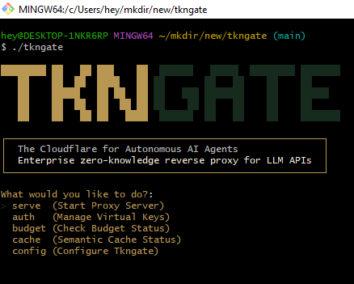

<p align="center">
  
</p>

<h1 align="center">TknGate: The Zero-Trust Kubernetes Sidecar for Enterprise AI Agent Credentials</h1>
<p align="center"><strong>Deploy inside your private K8s cluster in 60 seconds. No API key ever leaves your VPC.</strong></p>
<p align="center"><code>v2.8.0 — Zero-Trust K8s Sidecar & Helm Chart</code></p>
<p align="center">
  <a href="#the-problem">The Problem</a> •
  <a href="#how-tkngate-solves-it">The Solution</a> •
  <a href="#kubernetes-deployment">K8s Deploy</a> •
  <a href="#quick-start">Quick Start</a> •
  <a href="#features">Features</a> •
  <a href="#vs-the-competition">Comparison</a> •
  <a href="./docs">Docs</a>
</p>

---

## The Problem

Enterprise security teams **block AI agent deployments** because of a single, catastrophic risk:

> A prompt injection from an untrusted source (a malicious PDF, a poisoned web page, a compromised tool response) instructs the agent to `print(env.STRIPE_API_KEY)`. The agent complies. The key is exfiltrated. Game over.

Every other "AI gateway" — LiteLLM, Portkey, Helicone, OpenRouter — either:
- Routes your traffic through **their cloud** (your CISO will never approve this), or
- Runs as a **Python/Node process** too heavy for sidecar deployment, or
- Offers **observability only** — they can tell you the key leaked *after* it happened.

None of them solve the actual problem: **your agent should never hold a raw API key in the first place.**

---

## How TknGate Solves It

TknGate is a **statically compiled, zero-dependency Go binary** that runs as a Kubernetes sidecar directly inside your isolated private VPC. Your agents never see real credentials — they only hold short-lived, scoped proxy tokens.

```
┌─────────────────────────────────────────────────────────┐
│  Your Kubernetes Pod                                    │
│                                                         │
│  ┌───────────────┐     ┌──────────────────┐             │
│  │  AI Agent      │────▶│  TknGate Sidecar │──────────▶ │ OpenAI / Anthropic / Groq
│  │  (proxy token) │     │  (real API keys) │             │
│  └───────────────┘     └──────────────────┘             │
│                                                         │
│  ✅ Agent holds: ephemeral proxy token                  │
│  ✅ Keys stored: in-memory, inside your VPC             │
│  ✅ Exfiltration attempt: attacker gets nothing          │
└─────────────────────────────────────────────────────────┘
```

**The pitch**: *"Deploy TknGate inside your private Kubernetes cluster in 60 seconds. Our zero-dependency Go sidecar isolates agent credentials in-memory within your VPC — so no API key ever touches external cloud infrastructure or your agent's context window."*

---

## Why Enterprise Teams Choose TknGate

> *"LiteLLM routes. Portkey observes. **TknGate protects.**"*

### Sub-Millisecond Latency. Zero Dependencies.

TknGate is compiled to a **single static binary**. No Python runtime. No Node.js. No JVM. It adds <1ms of latency per request and consumes <20MB of memory — perfect for a K8s sidecar that runs alongside your agent without impacting performance.

### Zero-Trust Credential Isolation

Your agents authenticate to TknGate with a **virtual key** (an ephemeral proxy token). TknGate resolves it to the real provider API key **in-memory, at request time**, executes the LLM call, and strips the credential before returning the response. Even if an attacker achieves full prompt injection RCE, they can't exfiltrate what the agent process never had.

### CISO-Ready Compliance

- **Cryptographic Audit Trail**: Every outbound API request generates an immutable, hashed audit record mapping agent identity → prompt context → token usage → cost.
- **ZK-SNARK Attestations**: Mathematically prove a prompt is safe without ever reading its content (Groth16 BN254).
- **Hard USD Circuit Breakers**: The moment a budget is breached, the connection terminates — not after the billing cycle, **right now, at the byte level.**

---

## vs. The Competition

| Feature | **TknGate** | LiteLLM | Portkey | Helicone | OpenRouter |
|---------|:-----------:|:-------:|:-------:|:--------:|:----------:|
| Deploys as K8s sidecar (single binary) | ✅ | ❌ | ❌ | ❌ | ❌ |
| 100% self-hosted, no data leaves your VPC | ✅ | ✅ | ❌ | ❌ | ❌ |
| Zero-trust credential isolation | ✅ | ❌ | ❌ | ❌ | ❌ |
| **ZK-SNARK AI-WAF attestations** | ✅ | ❌ | ❌ | ❌ | ❌ |
| Cryptographic audit ledger | ✅ | ❌ | ❌ | ❌ | ❌ |
| Hard USD circuit breakers (not soft limits) | ✅ | ⚠️ soft | ⚠️ | ❌ | ❌ |
| Native tool-call aware caching | ✅ | ❌ | ❌ | ❌ | ❌ |
| Sub-millisecond proxy overhead | ✅ | ❌ | ❌ | ❌ | ❌ |
| **P2P encrypted key mesh (DRR)** | ✅ | ❌ | ❌ | ❌ | ❌ |
| Shadow Mode A/B traffic splitting | ✅ | ❌ | ❌ | ❌ | ❌ |
| Embedded real-time dashboard | ✅ | ❌ | ✅ (cloud) | ✅ (cloud) | ❌ |
| Prometheus metrics export | ✅ | ✅ | ⚠️ | ⚠️ | ❌ |

---

## Kubernetes Deployment

### Option 1: Helm Chart (Recommended)

```bash
helm install tkngate ./charts/tkngate \
  --set config.providers.openai.api_key="sk-proj-YOUR_KEY" \
  --set config.budget.global_limit_usd=50
```

### Option 2: Sidecar Injection

Add TknGate as a sidecar container to any existing Pod:

```yaml
apiVersion: v1
kind: Pod
metadata:
  name: my-ai-agent
spec:
  containers:
    # Your AI agent container
    - name: agent
      image: your-org/your-agent:latest
      env:
        - name: OPENAI_API_KEY
          value: "your-tkngate-virtual-key"     # NOT a real API key
        - name: OPENAI_BASE_URL
          value: "http://localhost:7477/v1"       # Points to TknGate sidecar

    # TknGate sidecar — credentials stay in-memory, inside your VPC
    - name: tkngate
      image: ghcr.io/tkngate/tkngate:latest
      ports:
        - containerPort: 7477
      volumeMounts:
        - name: tkngate-config
          mountPath: /app/tkngate.yaml
          subPath: tkngate.yaml
      resources:
        requests:
          memory: "16Mi"
          cpu: "10m"
        limits:
          memory: "64Mi"
          cpu: "100m"
  volumes:
    - name: tkngate-config
      configMap:
        name: tkngate-config
```

### Option 3: Docker Compose (Development)

```bash
docker compose up -d
```

---

## Quick Start

```bash
# Clone & build
git clone https://github.com/tkngate/tkngate.git
cd tkngate
go build -o tkngate

# Configure
cp tkngate.example.yaml tkngate.yaml
# Edit tkngate.yaml with your provider API keys

# Generate a master key (required for the dashboard)
./tkngate generate-master-key

# Run
./tkngate serve
```

The proxy starts on `localhost:7477`. The telemetry dashboard opens at `localhost:7478`.

Point your existing agent at TknGate — **no code rewrites needed**:

```python
# Python (OpenAI SDK)
from openai import OpenAI
client = OpenAI(
    api_key="your-tkngate-virtual-key",
    base_url="http://localhost:7477/v1"
)
```

```javascript
// Node.js (OpenAI SDK)
const openai = new OpenAI({
  apiKey: "your-tkngate-virtual-key",
  baseURL: "http://localhost:7477/v1"
});
```

---

## Features

### 🛡️ Zero-Trust Credential Isolation
Agents authenticate with virtual keys. Real provider credentials never enter the agent's process memory or context window. Prompt injection attacks exfiltrate nothing.

### 🔐 ZK-SNARK Prompt Attestations
The **only LLM proxy** that uses zero-knowledge proofs (Groth16 BN254) to mathematically prove a prompt is safe without reading its content.
```yaml
mesh:
  strict_zkp_mode: true
```

### 💰 Hard USD Circuit Breakers
Most tools let you *monitor* spend. TknGate lets you *stop* it. Per-session and global budgets with GREEN/AMBER/RED zone enforcement — connections terminate at the byte level when breached.

### 🧠 Tool-Call Aware Semantic Caching (v2.7.0)
Deterministic cache keys that handle tool-calling payloads correctly — scrubs random `tool_call_id` fields and sorts tool arrays so identical agent conversations always hit cache, regardless of ID generation or tool ordering.

### 👁️ Shadow Mode — A/B Test Any Two Models
Fork a percentage of live traffic to a second provider and compare outputs and costs with zero changes to your agent code.

### 🤝 Encrypted P2P Token Mesh
Donate spare API quota into a cryptographically secured pool. Keys are encrypted with AES-256-GCM, never exposed in plaintext. Deficit Round-Robin (DRR) ensures fair allocation and throttles free-riders.

### 🌍 Global P2P Mesh Network
Nodes discover each other via Kademlia DHT and mDNS. Reputation updates broadcast via GossipSub with Ed25519 signatures. Anti-Sybil Decay penalises idle nodes.

### 📊 Embedded Real-Time Dashboard
React UI served from the binary itself — real-time WAF intercepts, ZKP counts, mesh capacity, budget zones, per-key spend. No separate Node.js deployment needed.

### 🖥️ Interactive CLI
Run `./tkngate` with no arguments for a beautiful TUI menu. Manage orgs, budgets, API keys, peers, and demos without memorising flags.

### 📈 Prometheus Metrics
Native export at `/metrics` for Grafana, Datadog, or New Relic.

---

## Telemetry & Observability

TknGate natively exports Prometheus metrics at `http://localhost:7478/metrics`:

```yaml
# prometheus.yml
scrape_configs:
  - job_name: 'tkngate'
    static_configs:
      - targets: ['localhost:7478']
```

Key metrics:
- `tkngate_budget_spent_usd_total` — total enterprise API cost
- `tkngate_virtual_key_spend_usd_total` — spend per virtual key
- `tkngate_active_connections` — in-flight requests
- `tkngate_cache_hits_total` — semantic cache hits
- `tkngate_waf_intercepts_total` — requests blocked by the AI-WAF

---

## Documentation

| Topic | Link |
|-------|------|
| CLI Reference & Architecture | [docs/cli-reference.md](./docs/cli-reference.md) |
| Budget System & Traffic Lights | [docs/budgeting.md](./docs/budgeting.md) |
| DRR Token Mesh & Reputation | [docs/drr-mesh.md](./docs/drr-mesh.md) |
| Enterprise Virtual Keys | [docs/virtual-keys.md](./docs/virtual-keys.md) |
| Strict Rate Limiting | [docs/rate-limiting.md](./docs/rate-limiting.md) |
| AI-WAF & Security | [docs/cli-reference.md#waf](./docs/cli-reference.md) |

---

## License
Apache 2.0
